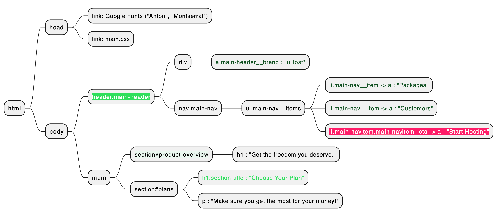

Here’s your CSS explained as a markup-style summary table so you can see at a glance what each selector does:

| **Selector**                                                  | **Purpose / Target**                | **Key Properties**                                                                                           | **Effect**                                                                 |
| ------------------------------------------------------------- | ----------------------------------- | ------------------------------------------------------------------------------------------------------------ | -------------------------------------------------------------------------- |
| `*`                                                           | All elements                        | `box-sizing: border-box;`                                                                                    | Includes padding and border inside the element’s width/height calculation. |
| `body`                                                        | Whole page                          | `font-family: "Montserrat", sans-serif;` `margin: 0;`                                                     | Uses Montserrat font, removes default body margin.                         |
| `#product-overview`                                           | Section with id `product-overview`  | `background: url("freedom.jpg");` `width: 100%;` `height: 528px;` `padding: 10px;`                  | Full-width section with background image and fixed height.                 |
| `.section-title`                                              | Elements with class `section-title` | `color: #2ddf5c;`                                                                                            | Makes section titles green.                                                |
| `#product-overview h1`                                        | Heading inside `#product-overview`  | `color: white;` `font-family: "Anton", sans-serif;`                                                       | White, bold headline with Anton font.                                      |
| `.main-header`                                                | Header container                    | `width: 100%;` `background: #2ddf5c;` `padding: 8px 16px;`                                             | Full-width green header with padding.                                      |
| `.main-header > div`                                          | Direct child `
` in header      | `display: inline-block;` `vertical-align: middle;`                                                        | Aligns header elements side-by-side, vertically centered.                  |
| `.main-header__brand`                                         | Brand link/logo text                | `color: #0e4f1f;` `text-decoration: none;` `font-weight: bold;` `font-size: 22px;`                  | Large, bold brand name in dark green without underline.                    |
| `.main-nav`                                                   | Navigation container                | `display: inline-block;` `text-align: right;` `width: calc(100% - 74px);` `vertical-align: middle;` | Places nav next to logo, right-aligned, takes remaining space.             |
| `.main-nav__items`                                            | `<ul>` list in nav                  | `margin: 0;` `padding: 0;` `list-style: none;`                                                         | Removes default list spacing and bullets.                                  |
| `.main-nav__item`                                             | Each list item                      | `display: inline-block;` `margin: 0 16px;`                                                                | Displays nav links horizontally with spacing.                              |
| `.main-nav__item a`                                           | Navigation links                    | `text-decoration: none;` `color: #0e4f1f;` `font-weight: bold;` `padding: 3px 0;`                   | Bold dark-green links without underline.                                   |
| `.main-nav__item a:hover, .main-nav__item a:active`           | Hover/active state for links        | `color: white;` `border-bottom: 5px solid white;`                                                         | Changes link to white with thick underline on hover.                       |
| `.main-nav__item--cta a`                                      | Special call-to-action link         | `color: white;` `background: #ff1b68;` `padding: 8px 16px;` `border-radius: 8px;`                   | White text on pink background with rounded corners.                        |
| `.main-nav__item--cta a:hover, .main-nav__item--cta a:active` | Hover/active CTA                    | `color: #ff1b68;` `background: white;` `border: none;`                                                 | Inverts CTA colors on hover, removes border.                               |

